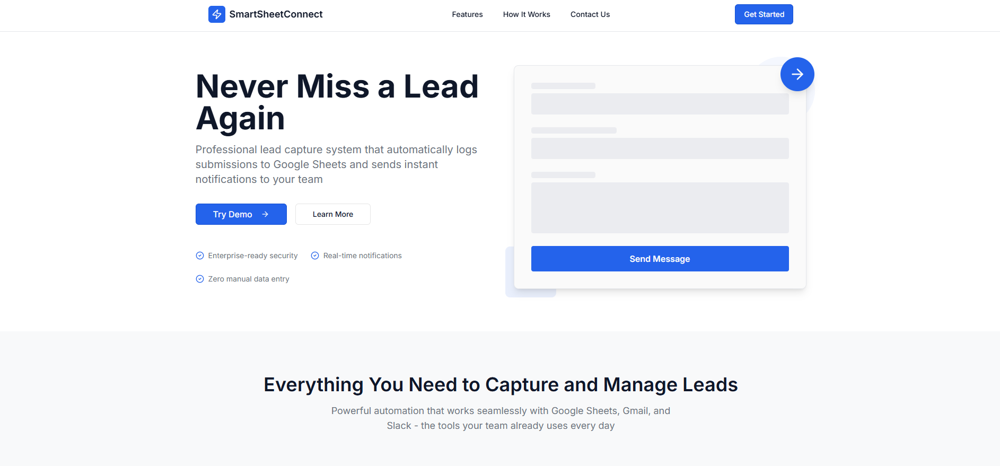
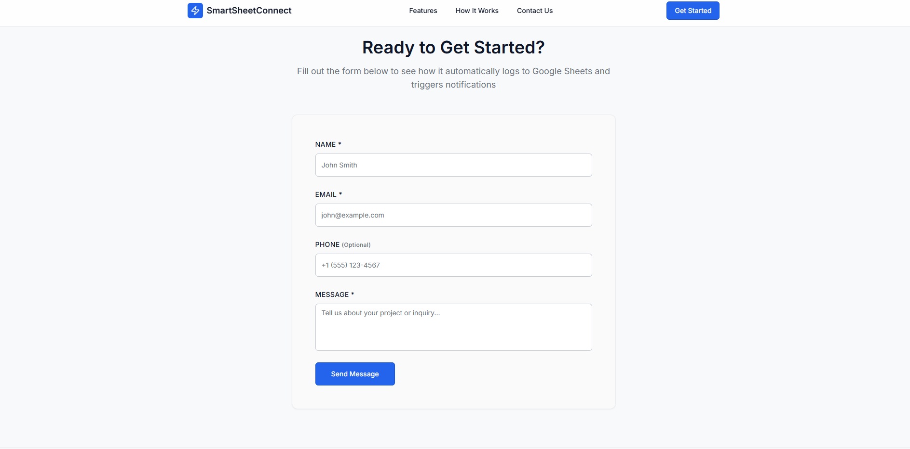
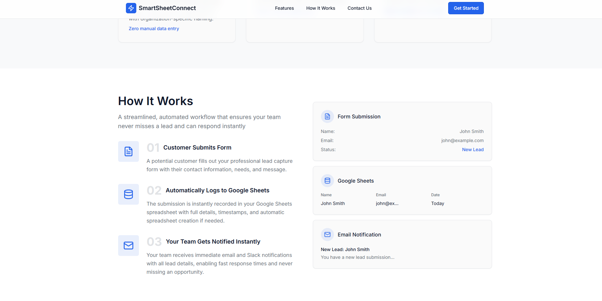

# 🧾 SmartSheetConnect

[]()
[]()
[]()
[]()


> A deploy-anywhere lead capture and notification system — automatically logs web form submissions to Google Sheets, and sends new-lead notifications via Slack and Gmail once configured.

SmartSheetConnect is a **full-stack TypeScript application** that automates lead capture by connecting web forms directly to Google Sheets and optional notification channels. It provides a clean, efficient alternative to paid integrations like Zapier — built for developers who want full control.

---

## ⚙️ Overview

SmartSheetConnect includes a lead capture form that:

- Validates and stores submissions in Google Sheets  
- Sends email notifications via Gmail API  
- Posts notifications to Slack channel  
- Includes spam protection and rate limiting  
- **Automatically manages spreadsheets** – creates and reuses the same one for all submissions  
- **Zero manual setup** – all leads are logged automatically

Built with **React**, **Express**, and **TypeScript**, and integrates seamlessly with Google APIs and Slack Webhooks.

---

## 🖼️ Screenshots


<br />

<br />

<br />

---

## 🚀 Features

- Input validation with Zod schemas  
- Automatic Google Sheets creation and logging  
- Gmail and Slack notifications  
- Honeypot spam protection  
- Rate limiting (100 requests per 15 minutes)  
- Health check endpoint (`/api/health`)  
- 33 automated tests covering schema, API, and UI  
- 100% TypeScript  

---

## 🧰 Tech Stack

**Frontend:**
- React 18  
- TypeScript  
- Vite  
- React Hook Form + Zod  
- TanStack Query  
- Tailwind CSS + shadcn/ui  

**Backend:**
- Node.js + Express  
- TypeScript  
- Google APIs (Sheets, Drive, Gmail)  
- Slack Webhooks  

**Testing:**
- Vitest  
- React Testing Library  
- Supertest  

---

## ⚡ Getting Started

### Prerequisites
- Node.js 18+  
- npm or yarn  
- Google Cloud account  
- (Optional) Slack webhook for notifications  

### Installation

```bash
git clone https://github.com/lindseystead/SmartSheetConnect.git
cd SmartSheetConnect
npm install
cp .env.example .env


### Configuration

**Note:** Setting up Google Cloud credentials requires technical knowledge. Need help? See [Setup Help](#need-setup-help) below or [LICENSING.md](./LICENSING.md) for commercial options.

1. **Google Cloud Setup**
   
   **Step 1: Create Project & Enable APIs**
   - Create a Google Cloud project at [console.cloud.google.com](https://console.cloud.google.com)
   - Enable required APIs:
     - **Google Sheets API** (required) - [Enable](https://console.cloud.google.com/apis/library/sheets.googleapis.com)
     - **Google Drive API** (recommended) - [Enable](https://console.cloud.google.com/apis/library/drive.googleapis.com)
     - **Gmail API** (optional, for email notifications) - [Enable](https://console.cloud.google.com/apis/library/gmail.googleapis.com)
   
   **Step 2: Create OAuth Credentials**
   - Go to "APIs & Services" → "Credentials"
   - Click "Create Credentials" → "OAuth client ID"
   - If prompted, configure OAuth consent screen first
   - Application type: "Web application"
   - Copy your **Client ID** and **Client Secret**
   
   **Step 3: Generate Refresh Token**
   - Go to [OAuth 2.0 Playground](https://developers.google.com/oauthplayground/)
   - Click **Settings** (gear icon) → Check **"Use your own OAuth credentials"**
   - Enter your **Client ID** and **Client Secret**
   - In **Step 1**, select these scopes:
     - `https://www.googleapis.com/auth/spreadsheets`
     - `https://www.googleapis.com/auth/drive`
     - `https://www.googleapis.com/auth/gmail.send` (if using email notifications)
   - Click **"Authorize APIs"** and sign in with your Google account
   - In **Step 2**, click **"Exchange authorization code for tokens"**
   - Copy the **Refresh token** (starts with `1//0...`)

2. **Environment Variables**
   
   Create `.env` file with required variables:
   
   ```env
   # Required
   GOOGLE_CLIENT_ID=your-client-id
   GOOGLE_CLIENT_SECRET=your-client-secret
   GOOGLE_REFRESH_TOKEN=your-refresh-token
   NOTIFICATION_EMAIL=your-email@example.com

   # Optional
   ORGANIZATION_NAME=Your Company Name
   SPREADSHEET_ID=existing-spreadsheet-id
   SLACK_WEBHOOK_URL=https://hooks.slack.com/services/...
   PORT=5000
   HOST=localhost
   ALLOWED_ORIGINS=https://yoursite.com
   ```

3. **Slack Setup** (Optional)
   - Create Slack app at [api.slack.com/apps](https://api.slack.com/apps)
   - Enable "Incoming Webhooks" feature
   - Add webhook to workspace and copy URL
   - Add to `.env` as `SLACK_WEBHOOK_URL`

### Need Setup Help?

Setting up Google Cloud credentials and deploying can be complex. **Professional setup services are available:**

-  Google Cloud project configuration
-  OAuth credentials setup
-  Testing and verification
-  Custom domain configuration (optional)


### Development

```bash
npm run dev
```

Visit `http://localhost:5000`

### Production Build

```bash
npm run build
npm start
```

## Google Sheets Behavior

- **Automatic Spreadsheet Management:**
  - Searches for existing spreadsheet named: `SmartSheetConnect - [Organization Name] - Website Form Leads`
  - Creates new spreadsheet if not found
  - **Automatically saves `SPREADSHEET_ID` to `.env` file** after first creation
  - Always reuses the same spreadsheet for all submissions
  - Prevents duplicate spreadsheets, even after server restarts

- **Spreadsheet Title Format:**
  - Uses your `ORGANIZATION_NAME` from `.env` file
  - Format: `SmartSheetConnect - [Your Organization Name] - Website Form Leads`
  - Defaults to "Your Organization" if not set

- **Manual Override:**
  - Set `SPREADSHEET_ID` in `.env` to use a specific spreadsheet
  - Takes priority over name-based search

## API Endpoints

### `POST /api/submit-lead`

Submits a lead submission.

**Request:**
```json
{
  "name": "John Doe",
  "email": "john@example.com",
  "phone": "(555) 123-4567",  // optional
  "message": "Interested in your services"
}
```

**Response:**
```json
{
  "success": true,
  "message": "Lead submitted successfully",
  "rowNumber": 2
}
```

### `GET /api/health`

Returns server health status.

## Testing

```bash
# Run tests
npm test

# Run with coverage
npm run test:coverage

# Run once (CI)
npm run test:run
```

Test coverage includes:
- Schema validation tests
- API endpoint tests
- React component tests

## Project Structure

```
SmartSheetConnect/
├── client/          # React frontend
├── server/          # Express backend
│   ├── routes.ts    # API endpoints
│   └── services/    # Google Sheets, email, Slack integrations
├── shared/          # Shared TypeScript types and Zod schemas
└── package.json
```

## Security

- Input validation with Zod schemas
- Rate limiting (100 requests/15 min per IP)
- Security headers via Helmet.js
- CORS configuration
- Honeypot spam protection
- Request size limits (10MB)
- Environment variables for sensitive data
- No credentials in codebase

**Important:** 
- Each business must use their own Google Cloud credentials
- Never commit `.env` files to version control
- Setting up Google Cloud requires technical knowledge


### 🪪 Licensing & Commercial Use
SmartSheetConnect is released under the MIT License — free for personal and developer use.


## Author

Lindsey Stead

- GitHub: [@lindseystead](https://github.com/lindseystead)
- LinkedIn: [lindseystead](https://linkedin.com/in/lindseystead)

---

### 🧠 Keywords
Lead capture · TypeScript · React · Node.js · Google Sheets API · Slack API · Gmail API · Automation · Zapier Alternative · SaaS Integration

