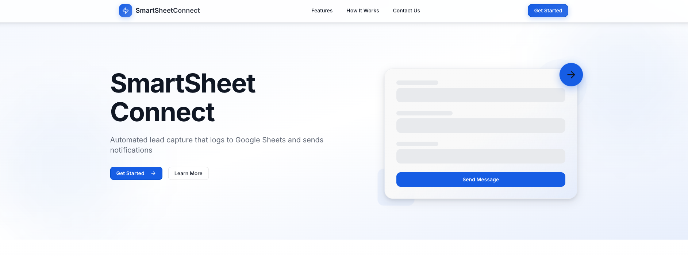
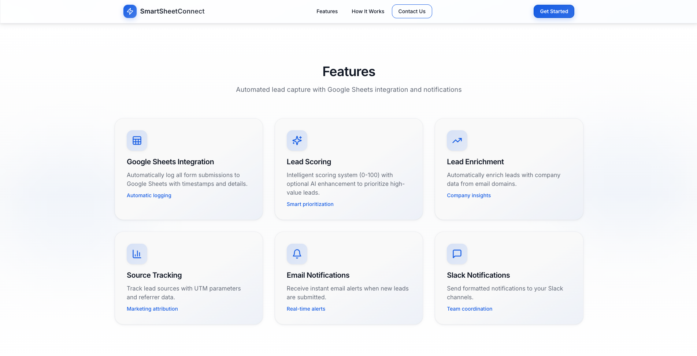
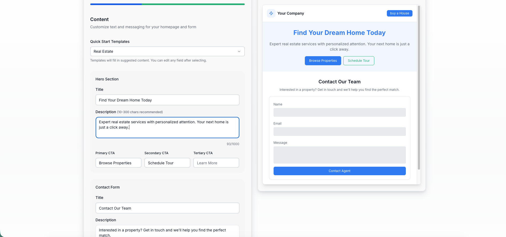
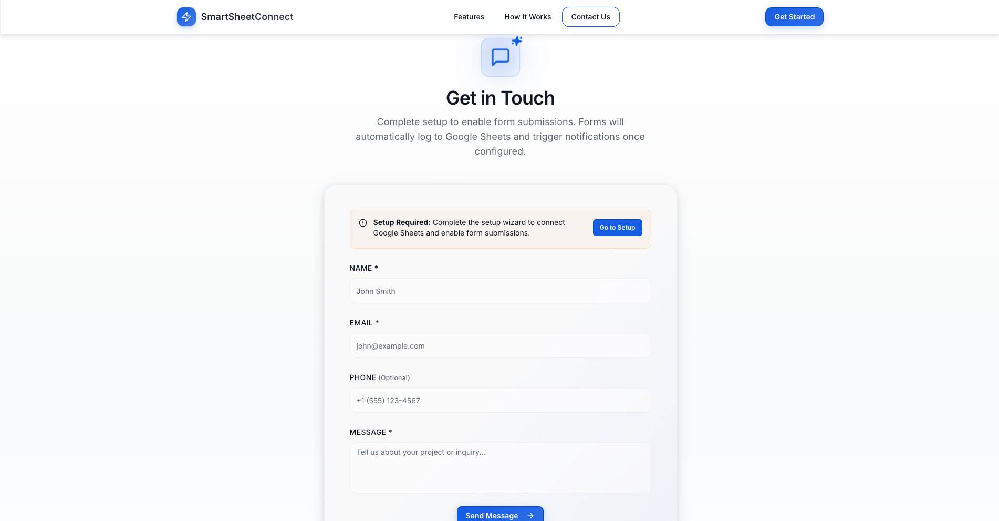

# SmartSheetConnect — Frontend

Frontend for a white-label, embeddable lead capture platform: React/TypeScript app and shared Zod schemas. Backend services are not included in this repository.

[](https://www.typescriptlang.org/)
[](https://reactjs.org/)

## Overview

React application with runtime theming, embeddable form components, multi-step setup wizard, React Query for server state, and React Hook Form + Zod validation. The frontend calls backend APIs; when no backend is configured, the UI degrades gracefully.

### Screenshots

| | |
|---|---|
| [](assets/homepage.png) | **Landing** — Hero, features, CTA |
| [](assets/features.png) | **Features** — Sheets integration, lead scoring, notifications |
| [](assets/setup_2.png) | **Setup Wizard** — Branding, content, OAuth, notifications |
| [](assets/contact.png) | **Embeddable Form** — Contact form with validation |

## Features

- **Dynamic theming** via CSS variables and Tailwind
- **Embeddable components** for iframe/script embed
- **Setup wizard** with progress persistence
- **Shared Zod schemas** in `shared/` for validation and types
- **Error boundaries** and graceful API fallback

## Tech stack

React 18, TypeScript, Vite, Tailwind, shadcn/ui, TanStack Query, React Hook Form, Zod, Vitest

## Getting started

```bash
git clone https://github.com/lindseystead/smartsheetconnect.git
cd smartsheetconnect
npm install
npm run dev
```

App runs at `http://localhost:5173`.

## License

MIT — see [LICENSE](LICENSE).

Questions: [GitHub Issues](https://github.com/lindseystead/smartsheetconnect/issues)
